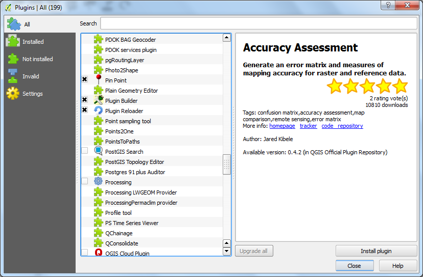
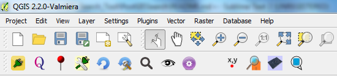

#PostGIS Search Plugin For QGIS#
##Background##

This plugin is designed to enable fast autocomplete like searching on a PostGIS database.

##How To use the PostGIS Search Plugin##
Before enabling the plugin in QGIS you will need to configure the PostGIS Search plugin so that in knows which PostGIS database, schema, table and column to search on. There are also two methods of searching to choose from:
- SQL (this is a simple SQL query using LIKE to find results)
- FTS (this method can be used to search PostgreSQL FTS columns. Furth information can be found later)

In the PostGIS Search Plugin directory there is a postgis.ini configuration file. Open this in a text editor and you should see the following:

[postgis]
postgisdatabase =
postgisusername =
postgispassword =
postgishost =
postgisport =
postgisschema =
postgistable =
postgissearchcolumn =
postgisdisplaycolumn =
postgisgeomname =
searchmethod =

Add in the relevent details of your setup, for example:

[postgis]
postgisdatabase = data
postgisusername = postgres
postgispassword = password
postgishost = localhost
postgisport = 5432
postgisschema = public
postgistable = locations
postgissearchcolumn = name
postgisdisplaycolumn = name
postgisgeomname = geom
searchmethod = SQL

Save the postgis.ini file and then launch QGIS 2.x

From the top QGIS toolbar click Plugins>Manage and Install Plugins...

Selec the PostGIS search from the list and the PostGIS Search icon should appear on your toolbar.

If you correctly entered the details into the postgis.ini file you should now be able to search and the plugin with fill the result box if it find results.

Click on one of the results and the location should be added to the map as a temporary layer and the map should zoom to that location.

#Thank Yous#
I would like to thank the following people for their support and testing during development.

-Matt Travis
-Simon Miles
-Ross McDonald
-Jonathan Moules

#FTS - Full Text Search#
Full Text Search, or as it is commonly reffered to as FTS, is a database data type which enables fast searching of data. Within PostgreSQL this datatype is reffered to as ts_vector. (http://www.postgresql.org/docs/9.3/static/datatype-textsearch.html)

I found some great blog posts that helped me understand FTS:
-http://coffeecode.net/archives/270-A-Flask-of-full-text-search-in-PostgreSQL.html
-http://www.youlikeprogramming.com/2012/01/full-text-search-fts-in-postgresql-9-1/

My general method to use FTS is to do the following:

-ALTER TABLE your_table ADD COLUMN new_column_name tsvector;
-UPDATE your_table SET new_column_name = to_tsvector('english', column_where_data_is);
-CREATE INDEX index_name ON your_table USING GIN(new_column_name);

Then to search the new tsvector you need a different SQL query

-SELECT * FROM your_table WHERE new_column_name @@ plainto_tsquery('english', 'query_string')

For searching tables of more than 1 million records adding FTS is definitely worth it when your original queries us LIKE rather than '='.

##Old background information##
It was considered there were two possible methods of giving the plugin as much flexbility as possible.

#Option 1: PostGIS Configuration File#
This option would use a PostGIS configuration file that the plugin would read on opening to get the correct database connection settings, including:
- Host
- Port
- Username
- Database name
- Database table
- Database schema
- Database column
- Search method

This would enable a much simple UI that would allow for straight forward autocomplete searching with results displaying in a table.

#Option 2: Use the QGIS API and use already created PostGIS Connection Settings#
This is slightly more advanced as it would require getting hold of the saved PostGIS connection settings that the user has already created either via Db Manager or when adding a PostGIS layer.

This would allow the user to not have to edit the postgis.ini file which may be restricted becuase of their profile, however it would make the UI slightly more complex with the user having to select various dropdown boxes prior to searching.

#The Beginning#
So having emailed Matt Travis, Simon Miles and Jonathan Moules I have decided to start with option 1 and see how well it works.

The code attached will be a work in progress as I continually tweak and develop until it gets to an experimental release stage where the plugin will be avaliable from the QGIS Plugin Respository.

So please do not download the code for use with QGIS until I get to a release stage.

Tim Martin March 2014

