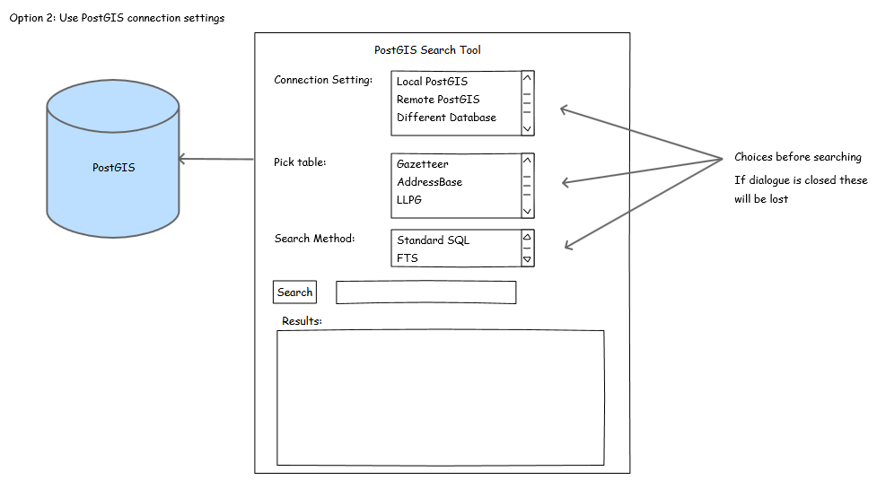

#PostGIS Search Plugin For QGIS#
##Background##

This plugin is designed to enable fast autocomplete like searching on a PostGIS database.

It was considered there were two possible methods of giving the plugin as much flexbility as possible.

#Option 1: PostGIS Configuration File#
This option would use a PostGIS configuration file that the plugin would read on opening to get the correct database connection settings, including:
- Host
- Port
- Username
- Database name
- Database table
- Database schema
- Database column
- Search method

This would enable a much simple UI that would allow for straight forward autocomplete searching with results displaying in a table.

#Option 2: Use the QGIS API and use already created PostGIS Connection Settings#
This is slightly more advanced as it would require getting hold of the saved PostGIS connection settings that the user has already created either via Db Manager or when adding a PostGIS layer.

This would allow the user to not have to edit the postgis.ini file which may be restricted becuase of their profile, however it would make the UI slightly more complex with the user having to select various dropdown boxes prior to searching.

#The Beginning#
So having emailed Matt Travis, Simon Miles and Jonathan Moules I have decided to start with option 1 and see how well it works.

The code attached will be a work in progress as I continually tweak and develop until it gets to an experimental release stage where the plugin will be avaliable from the QGIS Plugin Respository.

So please do not download the code for use with QGIS until I get to a release stage.

Tim Martin March 2014

